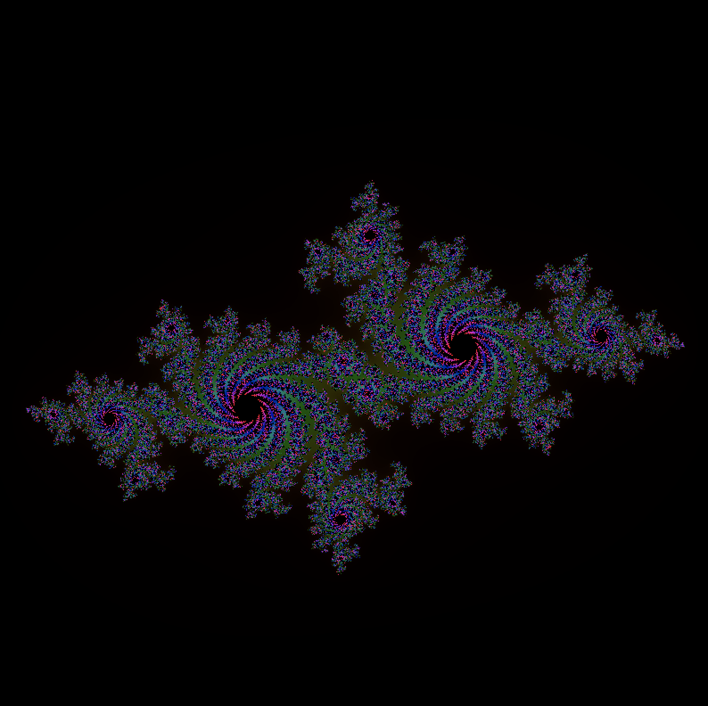
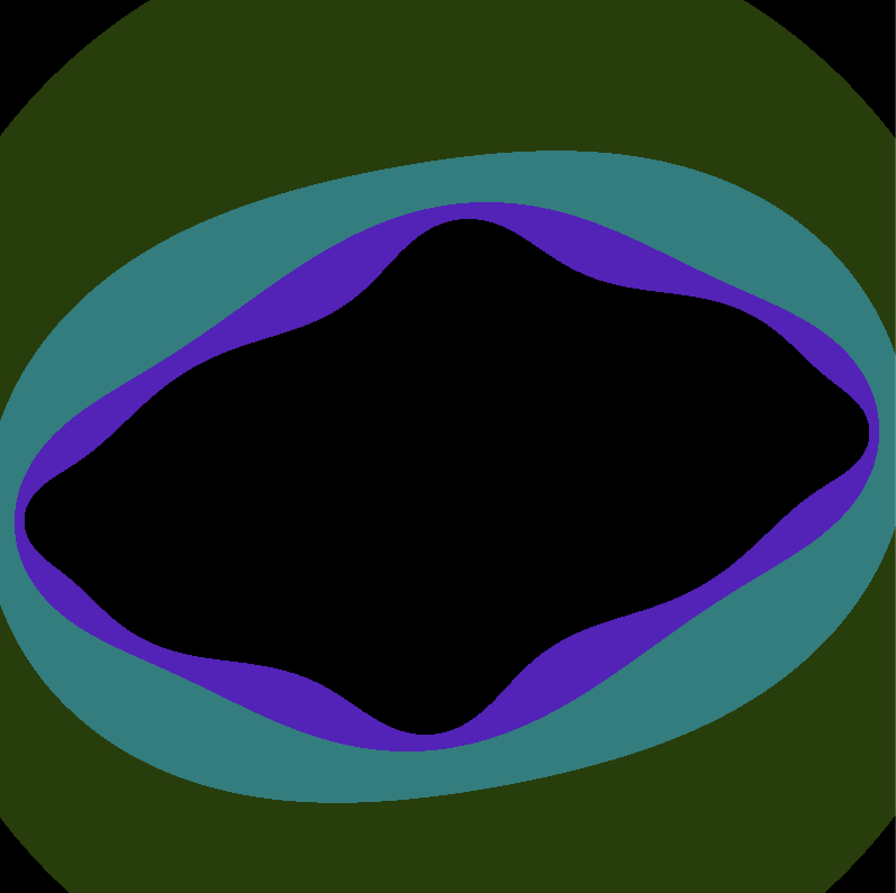
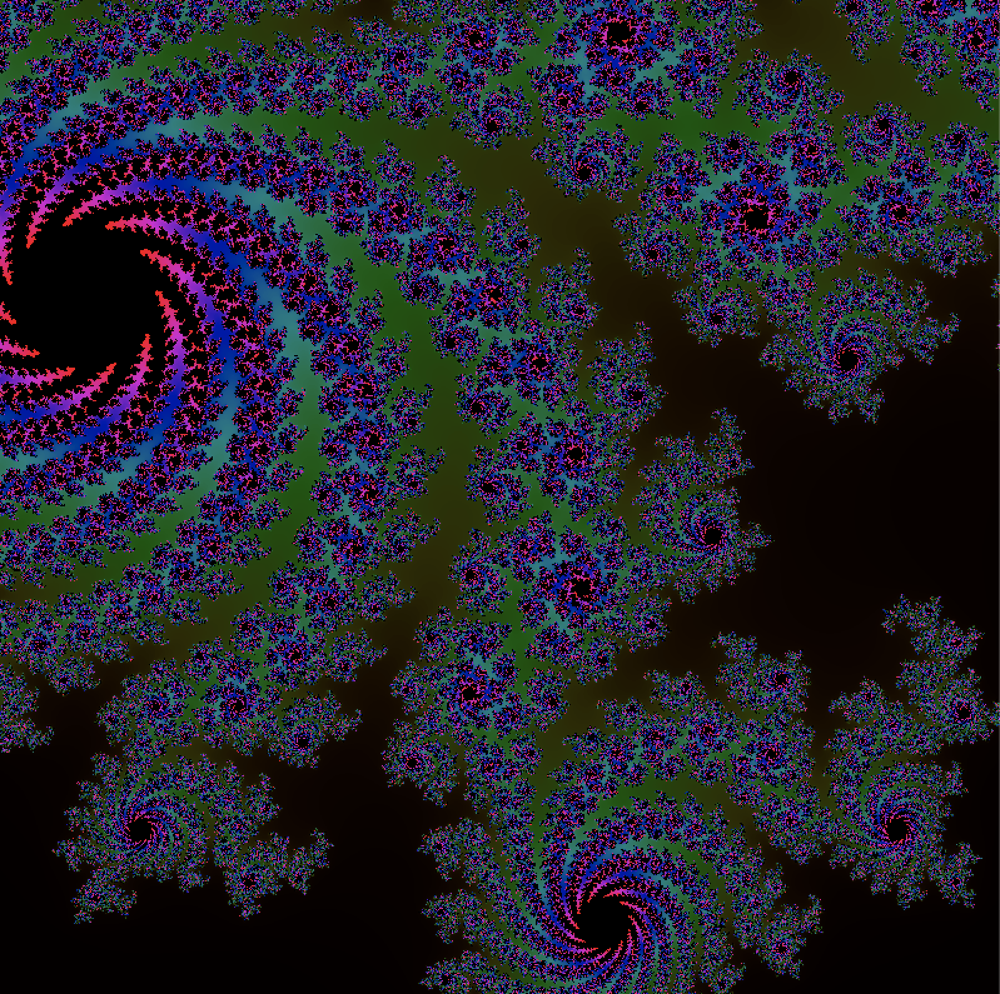
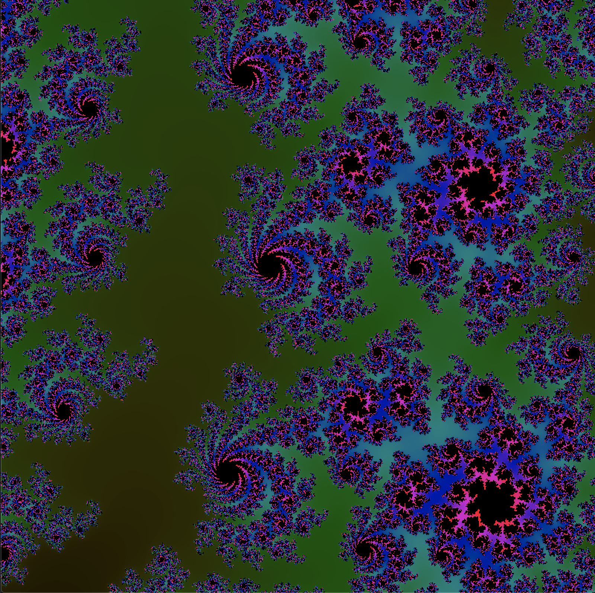
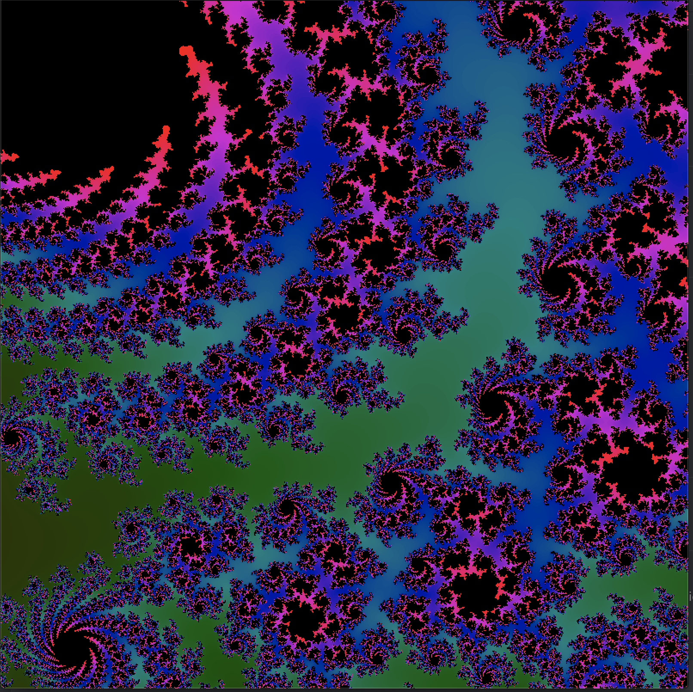
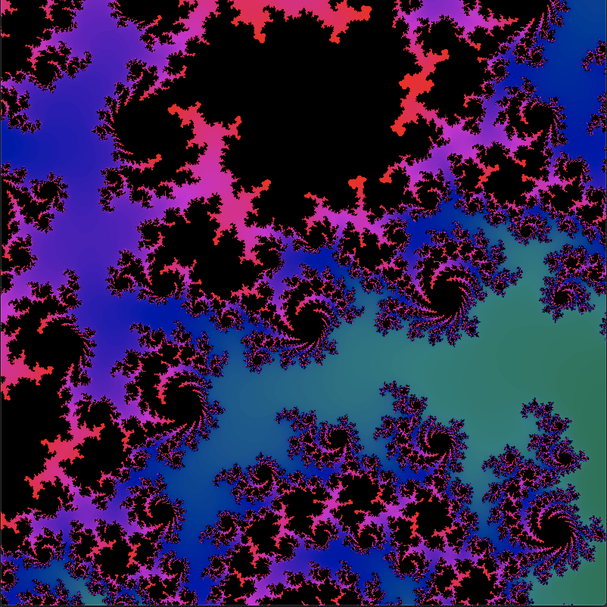
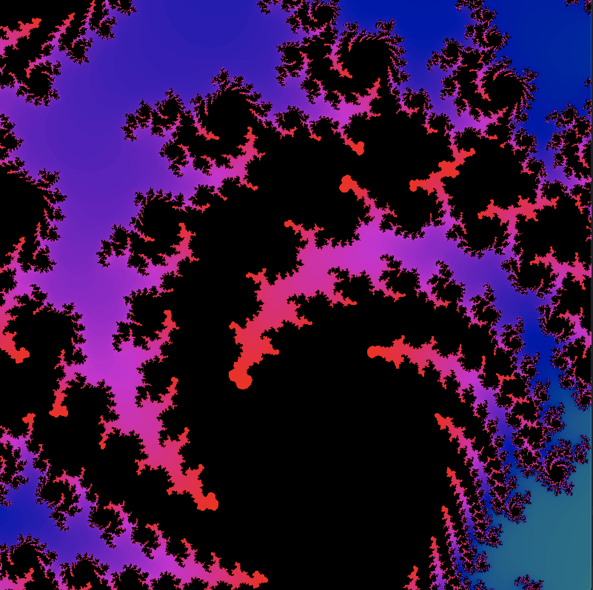

# Rulia
|  |  |
| :-------------: |:-------------:|
|  |  |
|  |  |
|  | [](https://youtu.be/zIn4UwnOfdY) |


This project draw the [julia set](https://en.wikipedia.org/wiki/Julia_set).

It uses the `minifb` crate for the window / drawing.

To build the project use:
```
cargo build --release
```

To run the project:
```
cargo run --release
```

This project is largely inspired, and share most of its code with the
[mandelbrüst](http://github.com/irevoire/mandelbrust) project.

## Control

- Use the arrow key to move on the fractal.
- Use `zqsd` to move
- Use `wasd` to move
- `i`: Augment the level of iteration
- `u`: Reduce the level of iteration
- `space`: Zoom in the fractal
- `x`: Unzoom the fractal
- `escape`: Exit
